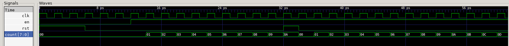
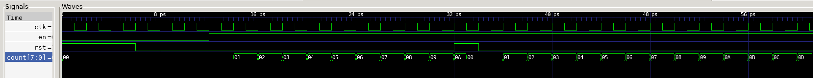
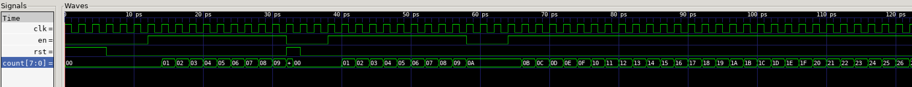
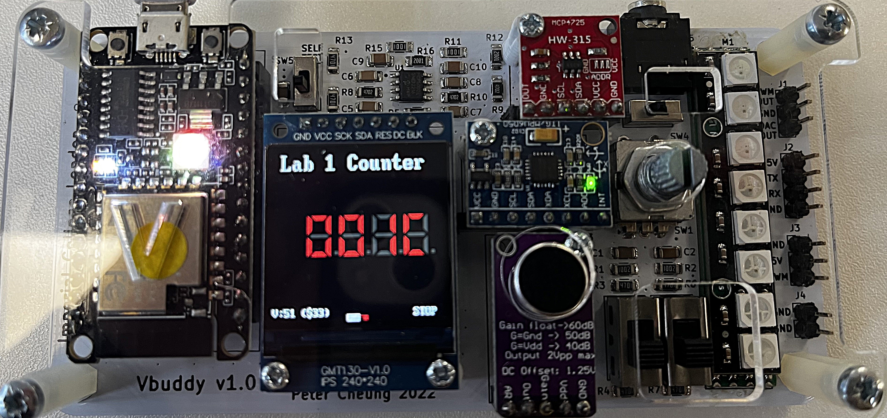
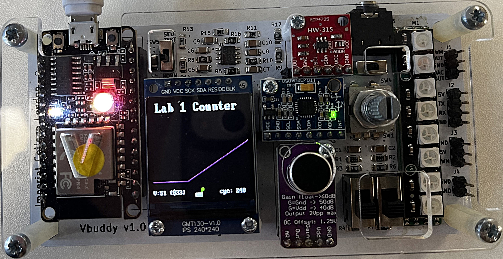
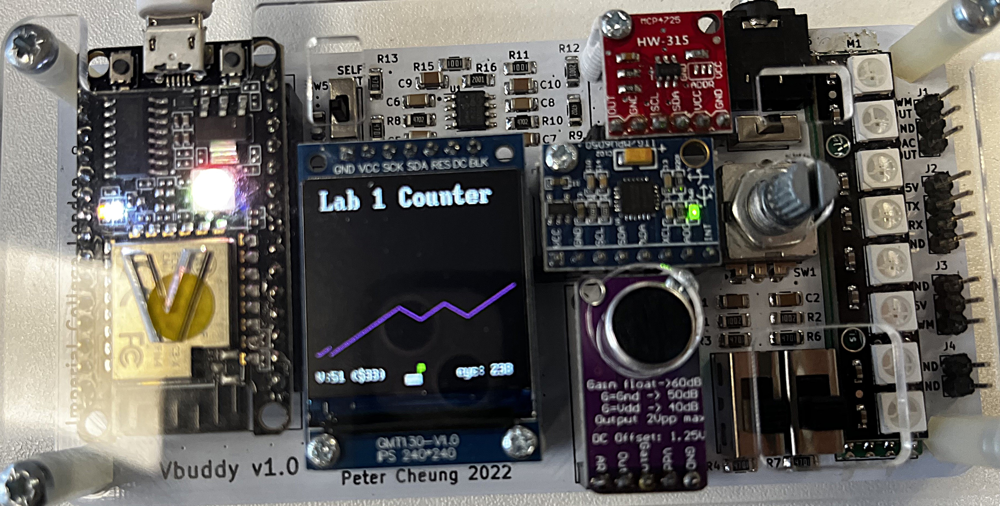
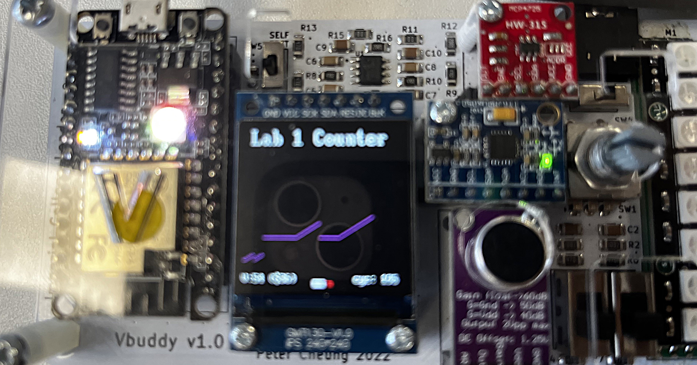
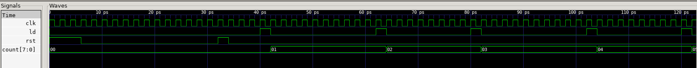
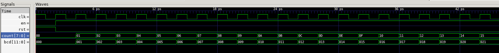

# Simulating an 8-Bit Binary Counter

---
### Synchronous Counter

#### counter.sv

```verilog
module counter #(
    parameter WIDTH = 8
)(
    input logic clk,
    input logic rst,
    input logic en,
    output logic [WIDTH-1:0] count
);
always_ff @ (posedge clk)
    if (rst) count <= {WIDTH{1'b0}};                
    else count <= count + {{WIDTH-1{1'b0}}, en};
endmodule
```

#### counter_tb.cpp

```cpp
#include "Vcounter.h"
#include "verilated.h"
#include "verilated_vcd_c.h"

int main(int argc, char **argv, char **env) {
    int i;
    int clk;
    
    Verilated::commandArgs(argc, argv);
    Vcounter* top = new Vcounter;
    
    Verilated::traceEverOn(true);
    VerilatedVcdC* tfp = new VerilatedVcdC;
    top->trace (tfp, 99);
    tfp->open ("counter.vcd");

    top->clk = 1;
    top->rst = 1;
    top->en = 0;

    for (i=0; i<300; i++){
        for (clk=0; clk<2; clk++) {
            tfp->dump (2*i+clk);
            top->clk = !top->clk;
            top->eval ();
        }
        top->rst = (i < 2) | (i == 15);
        top->en = (i > 4);
        
        if (Verilated::gotFinish()) exit(0);
    }
    tfp->close();
    exit(0);S
}
```

#### GTKWave Simulation



The resolution of the time axis in the GTKWave simulation is in picoseconds. This is reflective of the clock speed of the computer. For simulation this does not matter however in practice the clock frequency is important as it must accommodate the setup and hold time of the hardware.

---
### Asynchronous Counter Reset

#### counter.sv

```verilog
module counter #(
    parameter WIDTH = 8
)(
    input logic clk,
    input logic rst,
    input logic en,
    output logic [WIDTH-1:0] count
);

always_ff @ (posedge clk or posedge rst)
    if (rst) count <= {WIDTH{1'b0}};                
    else count <= count + {{WIDTH-1{1'b0}}, en};
endmodule
```

The `always_ff` block is now triggered by the clock or the positive edge of a reset signal. The addition of this trigger results in an asynchronous counter.

#### counter_tb.cpp

The implementation of `counter_tb.cpp` is identical for synchronous and asynchronous counters.

#### GTKWave Simulation



The simulation displays the additional logic is performing asynchronous reset as desired.

---
### `en` Disabled for 3 Cycles at Count `0x9` Challenge

#### counter.sv

The implementation of `counter.sv` is unchanged from the asynchronous counter.

#### counter_tb.cpp

```cpp
#include "Vcounter.h"
#include "verilated.h"
#include "verilated_vcd_c.h"

enum State {
    COUNTING,
    FREEZING
};

int main(int argc, char **argv, char **env) {
    int i;
    int clk;
    State state = COUNTING;
    int freeze_counter = 0;
  
    Verilated::commandArgs(argc, argv);
    Vcounter* top = new Vcounter;

    Verilated::traceEverOn(true);
    VerilatedVcdC* tfp = new VerilatedVcdC;
    top->trace (tfp, 99);
    tfp->open ("counter.vcd");

    top->clk = 1;
    top->rst = 1;
    top->en = 0;

    for (i=0; i<300; i++){
    
        for (clk=0; clk<2; clk++) {
            tfp->dump (2*i+clk);
            top->clk = !top->clk;
            top->eval ();
        }
        top->rst = (i < 2) | (i == 15);
        top->en = (i > 4);

        switch (state) {
            case COUNTING:
                if (top->count == 9) {
                    state = FREEZING;
                    freeze_counter = 3;
                }
                top->en = (i > 4);
                break;

            case FREEZING:
                top->en =0;
                freeze_counter--;
                if (freeze_counter == 0) {
                    state = COUNTING;
                }
                break;
        }
        if (Verilated::gotFinish()) exit(0);
    }
    tfp->close();
    exit(0);
}
```

To implement a pause for three cycles once the counter reaches `0x9` I used switch states. Switch states have faster code executions and would generalise well if the requirements of the pause were to be changed. I also find the use of switch statements more readable than multiple nested `if-else` statements.

#### GTKWave Simulation



The simulation displays the switch state logic is pausing the counting at any point that 0x9 is encountered as desired.

---
# Linking Verilator Simulation with Vbuddy

---
### Vbuddy Connection

#### counter.sv

```verilog
module counter #(
    parameter WIDTH = 8
)(
    input logic clk,
    input logic rst,
    input logic en,
    output logic [WIDTH-1:0] count
);

always_ff @ (posedge clk or posedge rst)
    if (rst) count <= {WIDTH{1'b0}};                
    else count <= count + {{WIDTH-1{1'b0}}, en};
endmodule
```

#### counter_tb.cpp

```cpp
#include "Vcounter.h"
#include "verilated.h"
#include "verilated_vcd_c.h"
#include "vbuddy.cpp"

int main(int argc, char **argv, char **env) {
    int i;
    int clk;
    Verilated::commandArgs(argc, argv);
    Vcounter* top = new Vcounter;

    Verilated::traceEverOn(true);
    VerilatedVcdC* tfp = new VerilatedVcdC;
    top->trace (tfp, 99);
    tfp->open ("counter.vcd");

    if (vbdOpen()!=1) return(-1);
    vbdHeader("Lab 1 Counter");
    top->clk = 1;
    top->rst = 1;
    top->en = 0;

    for (i=0; i<300; i++){
        for (clk=0; clk<2; clk++) {
            tfp->dump (2*i+clk);
            top->clk = !top->clk;
            top->eval ();
        }

        vbdHex(4, (int(top->count) >> 16) & 0xF);
        vbdHex(3, (int(top->count) >> 8) & 0xF);
        vbdHex(2, (int(top->count) >> 4) & 0xF);
        vbdHex(1, int(top->count) & 0xF);
        vbdCycle(i+1);

        // vbdPlot(int(top->count), 0, 255);
        // vbdCycle(i+1);

        top->rst = (i < 2) | (i == 15);
        top->en = vbdFlag();

        if (Verilated::gotFinish()) exit(0);
    }
    
    vbdClose();
    tfp->close();
    exit(0);
}
```

This `counter_tb.cpp` displays the hexadecimal counter on the Vbuddy seven-segment display using the `vbdHex` functions. This test bench also incorporated the Vbuddy flag `vbdFlag` as the enable signal. When the rotary is pressed this sets the flag high or low enabled or disabling the counter respectively. 

#### Vbuddy Output




The figures show that the Vbuddy plotting and seven-segment display are correctly displaying the counter value.

---
### Bi-Directional Counter Challenge

#### counter.sv

```verilog
module counter #(
    parameter WIDTH = 8
)(
    input logic clk,
    input logic rst,
    input logic en,
    output logic [WIDTH-1:0] count
);

always_ff @ (posedge clk or posedge rst)
    if (rst) count <= {WIDTH{1'b0}};
    else count <= count + (en ? {{WIDTH-1{1'b0}}, 1'b1} : -{{WIDTH-1{1'b0}}, 1'b1});
endmodule
```

#### counter_tb.cpp

The implementation of `counter_tb.cpp` is unchanged from the uni-directional counter.

#### Vbuddy Output



The figure shows that the bi-directional counter is correctly implemented. Each peak and trough corresponds to the rotary being pressed.

---
# One-Shot Vbuddy Parameter and Flag

--- 
### Loadable Counter

#### counter.sv

```verilog
module counter #(
    parameter WIDTH = 8
)(
    input  logic clk,
    input  logic rst,
    input  logic ld,
    input  logic [WIDTH-1:0] v,
    output logic [WIDTH-1:0] count
);  

always_ff @ (posedge clk)
    if (rst) count <= {WIDTH{1'b0}};
    else count <= ld ? v : count + {{WIDTH-1{1'b0}},1'b1};
endmodule
```

`counter.sv` uses a ternary operator to determine the behaviour of count dependent on whether `ld` has been enabled. When `ld` is enabled the count takes the pre-set value `v` else the count increments as usual.

#### counter_tb.cpp

```cpp
#include "Vcounter.h"
#include "verilated.h"
#include "verilated_vcd_c.h"
#include "vbuddy.cpp"  

int main(int argc, char **argv, char **env) {
    int i;
    int clk;  
    
    Verilated::commandArgs(argc, argv);
    Vcounter* top = new Vcounter;  

    Verilated::traceEverOn(true);
    VerilatedVcdC* tfp = new VerilatedVcdC;
    top->trace (tfp, 99);
    tfp->open ("counter.vcd");

    if (vbdOpen()!=1) return(-1);
    vbdHeader("Lab 1 Counter");
    
    top->clk = 1;
    top->rst = 1;
    top->ld = 0;

    for (i=0; i<300; i++){
        
        for (clk=0; clk<2; clk++) {
            tfp->dump (2*i+clk);
            top->clk = !top->clk;
            top->eval ();
        }  

        // vbdHex(4, (int(top->count) >> 16) & 0xF);
        // vbdHex(3, (int(top->count) >> 8) & 0xF);
        // vbdHex(2, (int(top->count) >> 4) & 0xF);
        // vbdHex(1, int(top->count) & 0xF);
        // vbdCycle(i+1);

        vbdPlot(int(top->count), 0, 255);
        vbdCycle(i+1);

        top->rst = (i < 2) | (i == 15);
        top->ld = vbdFlag();
        top->v = vbdValue();
        
        if (Verilated::gotFinish()) exit(0);
    }
    
    vbdClose();
    tfp->close();
    exit(0);
}
```

`vbdFlag` now enables the loading the value of `v` into the counter, read from the Vbuddy using `vbdValue` into the counter. 

#### Vbuddy Output



This output plot resets to the pre-set `v` value when the rotary is pressed and increments otherwise.

---
### One-Shot Counter

#### counter.sv

```verilog
module counter #(
    parameter WIDTH = 8
)(
    input  logic clk,
    input  logic rst,
    input  logic ld,
    input  logic [WIDTH-1:0] v,
    output logic [WIDTH-1:0] count
);  

always_ff @ (posedge clk)
    if (rst) count <= {WIDTH{1'b0}};
    else if (ld) count <= count + {{WIDTH-1{1'b0}},1'b1} : count;
endmodule
```

`counter.sv` has now has new logic when `ld` is enabled. Only when the rotary is pressed `ld` is enabled, and the count increments by one. The one shot behaviour is set in `counter_tb.cpp`.

### counter_tb.cpp

```cpp
#include "Vcounter.h"
#include "verilated.h"
#include "verilated_vcd_c.h"
#include "vbuddy.cpp"  

int main(int argc, char **argv, char **env) {
    int i;
    int clk;  

    Verilated::commandArgs(argc, argv);
    Vcounter* top = new Vcounter;  

    Verilated::traceEverOn(true);
    VerilatedVcdC* tfp = new VerilatedVcdC;
    top->trace (tfp, 99);
    tfp->open ("counter.vcd");  

    if (vbdOpen()!=1) return(-1);
    vbdHeader("Lab 1 Counter");
    vbdSetMode(1);

    top->clk = 1;
    top->rst = 1;
    top->ld = 0;

    for (i=0; i<100; i++){
        for (clk=0; clk<2; clk++) {
            tfp->dump (2*i+clk);
            top->clk = !top->clk;
            top->eval ();
        }

        vbdHex(4, (int(top->count) >> 16) & 0xF);
        vbdHex(3, (int(top->count) >> 8) & 0xF);
        vbdHex(2, (int(top->count) >> 4) & 0xF);
        vbdHex(1, int(top->count) & 0xF);
        vbdCycle(i+1);

        top->rst = (i < 2) | (i == 15);
        top->ld = vbdFlag();
        top->v = vbdValue();

        if (Verilated::gotFinish()) exit(0);
    }
    vbdClose();
    tfp->close();
    exit(0);
}
```

`vbdSetMode(1)` changes the Vbuddy mode of operation to one shot. This means when the flag is armed, the enable is set high and then immediately reset low until the rotary is again pressed. This  makes the pressing of the rotary behave like a clock signal.

### GTKWave Simulation



The output simulation show that the count only increment when `ld` is high, implementing the desired one-shot behaviour.

---
# Displaying Count as BCD

---

#### bin2bcd.sv

```verilog
module bin2bcd (
   input  logic [7:0]   x,       
   output logic [11:0]  BCD     
);
   logic  [19:0] result;
   integer i;
   always_comb
   begin
      result[19:0] = 0;
      result[7:0] = x;   

      for (i=0; i<8; i=i+1) begin
         if (result[11:8] >= 5)
            result[11:8] = result[11:8] + 4'd3;
         
         if (result[15:12] >= 5)
            result[15:12] = result[15:12] + 4'd3;  
            
         result = result << 1;
      end
      
      BCD = result[19:8];
   end
endmodule
```

This System Verilog file implements the conversion from binary to BCD. 

#### Binary to BCD Conversion Algorithm

Shift the binary number left one bit at a time into a 12 bit BCD result with spaces for hundreds, tens and ones.
If the shift leads to any value which exceeds 5 after a shift, three is added.
Adding three prevents the the BCD digit exceeding the valid range by wrapping the value back between 0 and 9. 
Continue shifting and adjusting until the conversion is complete.

#### top.sv

```verilog
module top #(
  parameter WIDTH = 8
)(
  input  logic clk,
  input  logic rst,
  input  logic en,
  input  logic [WIDTH-1:0] v,
  output logic [11:0] bcd
);
  logic [WIDTH-1:0] count;

counter myCounter (
  .clk (clk),
  .rst (rst),
  .en (en),
  .count (count)
);

bin2bcd myDecoder (
  .x (count),
  .BCD (bcd)
);

endmodule
```

`top.sv` is a top level module which contains the counter module and the binary to BCD conversion module.

#### counter.sv

The implementation of `counter.sv` is identical to the standard synchronous counter.

#### top_tb.cpp

The implementation of `top_tb.cpp` is identical to the standard synchronous counter `counter_tb.cp` implementation but using bcd instead of count for the output.

**doit.sh**
```shell
#!/bin/sh

~/Documents/iac/lab0-devtools/tools/attach_usb.sh

rm -rf obj_dir
rm -f counter.vcd

verilator -Wall --cc --trace top.sv counter.sv bin2bcd.sv --exe top_tb.cpp

make -j -C obj_dir/ -f Vtop.mk Vtop

obj_dir/Vtop
```

The `doit.sh` file has been modified to include of the modules so that the Verilated model is correctly compiled.

**GTKWave Simulation**



This Simulation output shows the count value and correct corresponding BCD conversion value.
